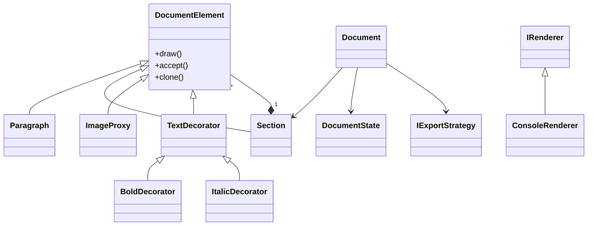

# Structured Document Editor — Core Framework

ไลบรารีภาษา C++17 สำหรับสร้างระบบแก้ไขเอกสารแบบมีโครงสร้าง (Structured Document Editor)
เน้นการออกแบบด้วย **Design Patterns** และ **Software Architecture**
สามารถนำไปต่อยอดเป็น Console, GUI หรือ Web Application ได้

---

## 📁 Project Structure

```bash
document-editor/
│── CMakeLists.txt
│── README.md
│
├── include/        # Header files (interfaces + core logic)
│   ├── Document / Element core
│   ├── Design Patterns (Adapter, Builder, Command, etc.)
│   ├── Renderer / Strategy / State
│   └── Utility (Serializer, Validator)
│
└── src/            # Implementation files
    ├── main.cpp
    ├── ConsoleRenderer.cpp
    ├── Paragraph.cpp
    ├── RealImage.cpp
    └── ImageProxy.cpp
```

### 🧠 แนวคิดโครงสร้าง

* `include/` → รวม abstraction และโครงสร้างหลักของระบบ
* `src/` → implementation ของ class ที่ต้อง compile จริง
* แยก header (`.h/.hpp`) และ implementation (`.cpp`) ชัดเจน

---

## 🚀 วิธีคอมไพล์และรัน

### Requirements

* C++17 compiler (g++ / clang++)
* (Optional) CMake ≥ 3.10

### ใช้ CMake

```bash
mkdir build && cd build
cmake ..
cmake --build .
./DocumentEditor
```

### ใช้ g++

```bash
g++ -std=c++17 -Wall -Wextra -Iinclude src/*.cpp -o DocumentEditor
./DocumentEditor
```

---

## 🏗️ Architecture Overview

```text
DocumentElement (abstract)
 ├── Paragraph
 ├── RealImage
 ├── ImageProxy
 ├── Section (Composite)
 └── TextDecorator
      ├── BoldDecorator
      └── ItalicDecorator

Document
 ├── Builder
 ├── Observer
 ├── State
 ├── Strategy
 └── Memento

IRenderer (Bridge)
 └── ConsoleRenderer

Visitor
 ├── WordCountVisitor
 ├── XMLExportVisitor
 └── MarkdownExportVisitor
```

---

## 📊 Class Diagram (Simplified)



---

## 🧠 Design Patterns ที่ใช้

### 🏗️ Creational

* **Singleton** — `ApplicationSettings`
* **Builder** — `DocumentBuilder`
* **Factory Method** — `ElementFactory`
* **Prototype** — `clone()`

### 🧱 Structural

* **Composite** — `Section`
* **Decorator** — `Bold / Italic`
* **Flyweight** — `CharacterFormat`
* **Proxy** — `ImageProxy`
* **Bridge** — `IRenderer`
* **Facade** — `FileManagerFacade`
* **Adapter** — `ShapeAdapter`

### 🔄 Behavioral

* **Command + Memento** — Undo/Redo system
* **Observer** — Document → StatusBar
* **State** — Draft / Review / Published
* **Strategy** — Export (Markdown / PDF)
* **Iterator** — Tree traversal
* **Visitor** — WordCount / Export
* **Template Method** — Document validation

> หมายเหตุ: มีไฟล์ `Chain.h`, `Mediator.h`, `Interpreter.h` สำหรับขยายระบบในอนาคต (ยังไม่ใช้งานเต็มรูปแบบ)

---

## 🧩 SOLID Principles

* **SRP** — แยกหน้าที่แต่ละ class ชัดเจน
* **OCP** — เพิ่ม feature ได้โดยไม่แก้โค้ดเดิม
* **LSP** — subclass ใช้แทน parent ได้
* **ISP** — interface เล็กและเฉพาะทาง
* **DIP** — ขึ้นกับ abstraction

---

## ⚙️ Modern C++

* ใช้ `std::unique_ptr` สำหรับ ownership
* ใช้ `std::shared_ptr` เฉพาะ Flyweight
* ไม่มีการใช้ raw pointer (`new/delete`)

---

## ⚠️ Limitations

* `load()` ยังไม่ reconstruct object จริง (demo)
* PDF export เป็นการจำลอง
* บาง pattern (Chain, Mediator, Interpreter) ยังไม่ถูก integrate เต็มระบบ
