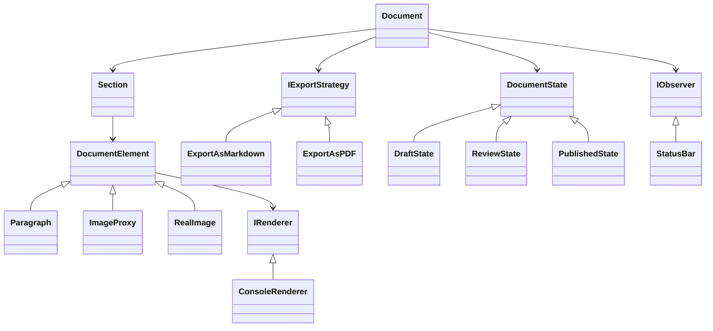

# Structured Document Editor — Core Framework

ไลบรารีแกนหลัก (Core Framework) สำหรับโปรแกรมแก้ไขเอกสารเชิงโครงสร้าง พัฒนาด้วยภาษา C++17 โดยออกแบบให้สามารถนำไปต่อยอดเป็นแอปพลิเคชันรูปแบบต่าง ๆ ได้ เช่น Console, GUI หรือ Web

โปรเจกต์นี้เน้นที่ **การออกแบบสถาปัตยกรรมภายในระบบ** โดยมีการนำ **Design Patterns** หลายรูปแบบมาใช้งานจริง และเชื่อมโยงกันเพื่อให้เห็นภาพการทำงานในระบบจริง

---

## การออกแบบ (Design Pattern Overview)

### 1. กลุ่ม Creational Patterns

* **Singleton (`ApplicationSettings`)**
  ใช้เก็บค่ากลางของระบบ เช่น font หรือ page size เพื่อให้มีแหล่งข้อมูลเดียว (Single Source of Truth)

* **Builder (`DocumentBuilder`)**
  ใช้สร้าง `Document` ที่มี option หลายแบบ (เช่น header, page size) โดยไม่ทำให้ constructor ซับซ้อน

* **Factory Method (`ElementFactory`)**
  ใช้สร้าง DocumentElement (Paragraph, Image, Section) โดยไม่ผูกกับ class จริง → เพิ่ม type ใหม่ได้โดยไม่แก้โค้ดเดิม

* **Prototype (`clone()`)**
  ใช้สำหรับ copy element และเป็นพื้นฐานของระบบ Undo/Redo (Memento)

---

### 2. กลุ่ม Structural Patterns

* **Composite (`Section`)**
  ทำให้โครงสร้างเอกสารเป็น tree → Section สามารถมี element ย่อยได้

* **Decorator (`BoldDecorator`, `ItalicDecorator`)**
  ใช้เพิ่ม style ให้ข้อความแบบ flexible โดยไม่ต้องสร้าง class ใหม่จำนวนมาก

* **Flyweight (`CharacterFormat`)**
  ลดการใช้ memory โดยแชร์ object format ที่เหมือนกัน

* **Proxy (`ImageProxy`)**
  โหลดรูปภาพจริงเฉพาะตอนที่ต้องใช้ → ช่วยเพิ่ม performance

* **Bridge (`IRenderer`)**
  แยก logic การ render ออกจากโครงสร้าง document → เปลี่ยน renderer ได้ง่าย

* **Facade (`FileManagerFacade`)**
  รวมขั้นตอน save/load ให้เรียกใช้ง่ายใน method เดียว

* **Adapter (`ShapeAdapter`)**
  ใช้เชื่อมระบบใหม่กับ library เก่าที่ interface ไม่ตรงกัน

---

### 3. กลุ่ม Behavioral Patterns

* **Command + Memento**
  ใช้ทำ Undo/Redo

  * Command = action
  * Memento = snapshot ของ document

* **Observer (`Document`, `StatusBar`)**
  เมื่อ document เปลี่ยน → notify observer เช่น อัปเดต word count

* **State (`Draft`, `Review`, `Published`)**
  เปลี่ยน behavior ของ document ตาม state

* **Strategy (`ExportAsMarkdown`, `ExportAsPDF`)**
  เปลี่ยนรูปแบบ export ได้ runtime

* **Iterator (`DocumentIterator`)**
  ใช้วน element โดยไม่เปิดเผยโครงสร้างภายใน

* **Visitor (`WordCountVisitor`, `ExportVisitor`)**
  เพิ่ม operation ใหม่โดยไม่แก้ class เดิม

* **Template Method (`DocumentValidator`)**
  กำหนด flow การ validate (structure → spelling → grammar)

---

## Class Diagram



> แผนภาพนี้แสดงโครงสร้างหลักของระบบแบบย่อ (Simplified View)

---

## วิธีคอมไพล์และรัน (Build & Run)

### ใช้ CMake

```bash
mkdir build && cd build
cmake ..
cmake --build .
./DocumentEditor
```

### ใช้ g++ โดยตรง

```bash
g++ -std=c++17 -Wall -Wextra -Iinclude src/*.cpp -o DocumentEditor
./DocumentEditor
```

---

## หมายเหตุเพิ่มเติม

* โปรแกรม `main.cpp` จะทำหน้าที่ demo การทำงานของ Design Pattern ทั้งหมด
* โค้ดถูกออกแบบตามหลัก **SOLID Principles**
* ใช้ `std::unique_ptr` เป็นหลักเพื่อจัดการ memory อย่างปลอดภัย

---
